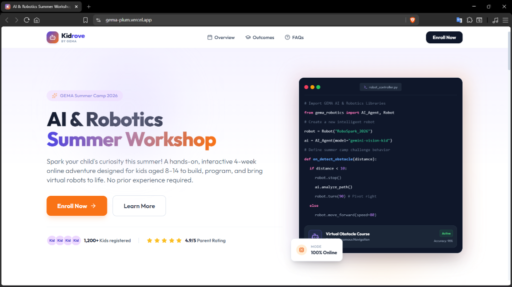
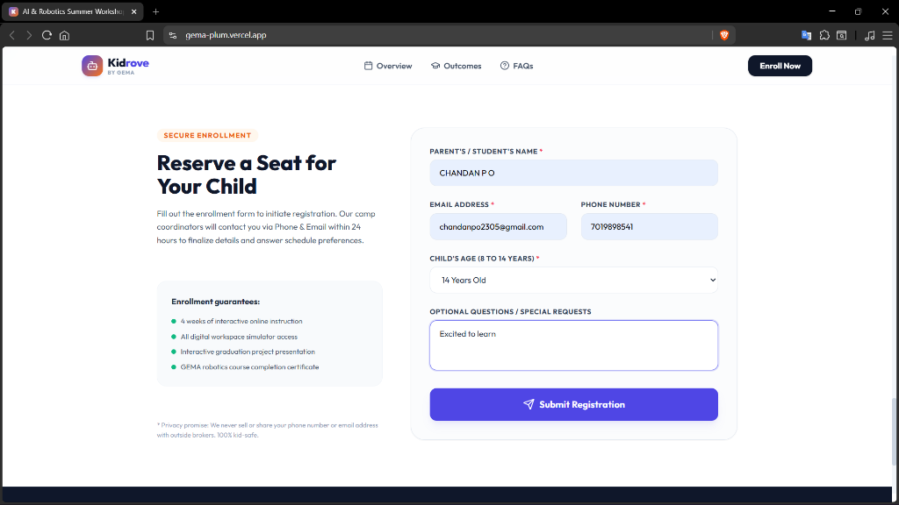
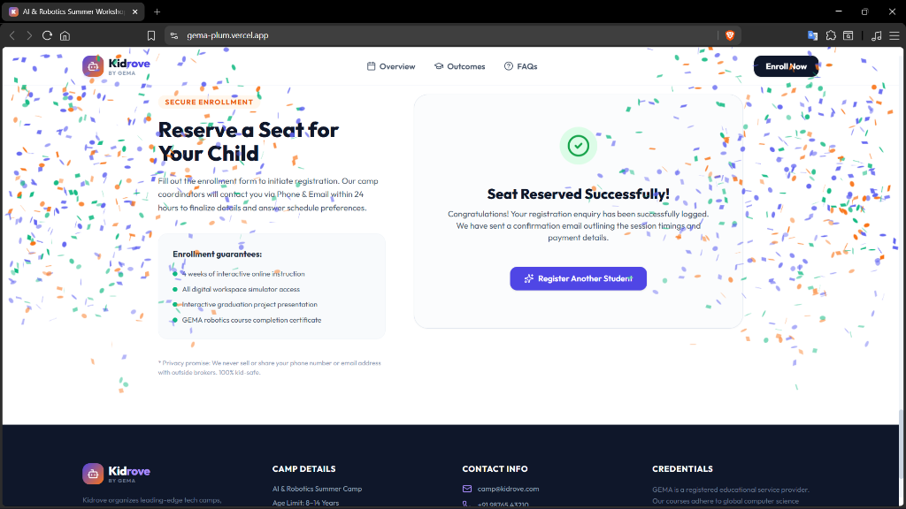

# GEMA AI & Robotics Summer Workshop Landing Page

A complete, production-grade implementation of the GEMA Education Technology and Pvt Ltd assignment. This project features a responsive, Kidrove-style landing page built with React, TypeScript, and Tailwind CSS, backed by a robust Express.js API with Zod validation and a Mongoose database schema (complete with a local JSON file fallback).

## 📸 Screenshots

### 1. Hero Section & Interactive Robotics IDE Dashboard


### 2. Live Enrollment Registration Form


### 3. Success Registration Confirmation (with Canvas Confetti celebration)


---

## 🏗️ Project Architecture & Structure

To maintain a clean separation of concerns, the project is divided into two distinct services:

```text
gema-workshop/
├── backend/                  # Express.js + TypeScript API
│   ├── src/
│   │   ├── config/db.ts      # Mongoose connector & fallback system
│   │   ├── models/Enquiry.ts # Enquiry schema & Mongoose Model
│   │   ├── controllers/      # Route controllers (enquiry validation & save)
│   │   └── server.ts         # Express server init
│   ├── package.json
│   └── tsconfig.json
├── frontend/                 # React + TypeScript + Tailwind CSS App
│   ├── src/
│   │   ├── components/       # Modular UI components
│   │   │   ├── Hero.tsx
│   │   │   ├── CourseDetails.tsx
│   │   │   ├── Outcomes.tsx
│   │   │   ├── FAQ.tsx
│   │   │   └── RegistrationForm.tsx
│   │   ├── App.tsx           # Layout, header, and footer
│   │   ├── main.tsx
│   │   └── index.css         # Tailwind & typography configurations
│   ├── tailwind.config.js
│   └── package.json
└── README.md                 # Project guide & instructions
```

---

## 🛠️ Technology Stack

### Frontend
- **React.js (v19)**: Framework for dynamic rendering.
- **TypeScript**: Typed safety for clean code.
- **Tailwind CSS (v3)**: Custom, responsive styles matching the Kidrove playground tech branding.
- **Lucide React**: High-quality SVG icons.
- **Canvas Confetti**: High-WOW success animation on form submission.

### Backend
- **Express.js (Node.js)**: Lightweight backend API router.
- **TypeScript**: Backend type safety.
- **Mongoose**: MongoDB object modeling tool.
- **Zod**: Robust, safe schema validation for incoming JSON request bodies.
- **CORS**: Enabler for cross-origin frontend requests.

---

## 🚀 Getting Started

### Prerequisites
Make sure you have **Node.js** (v18+) and **npm** installed on your system.

### 1. Setup & Start Backend
1. Navigate to the backend directory:
   ```bash
   cd backend
   ```
2. Install dependencies:
   ```bash
   npm install
   ```
3. Create a `.env` file (optional, defaults are already pre-configured):
   ```text
   PORT=5000
   MONGO_URI=mongodb://localhost:27017/kidrove-workshop
   ```
4. Start the backend in development mode:
   ```bash
   npm run dev
   ```
   *Note: If local MongoDB is not running or available, the server will log a warning and **automatically fall back to a local JSON database file (`backend/enquiries.json`)**. The API will remain fully operational!*

---

### 2. Setup & Start Frontend
1. Navigate to the frontend directory:
   ```bash
   cd frontend
   ```
2. Install dependencies:
   ```bash
   npm install
   ```
3. Start the Vite dev server:
   ```bash
   npm run dev
   ```
4. Open the app in your browser at: **[http://localhost:5173/](http://localhost:5173/)**

---

## 🔌 API Endpoints Documentation

The backend service runs at `http://localhost:5000`.

### 1. Submit Enquiry
- **Endpoint**: `POST /api/enquiry`
- **Headers**: `Content-Type: application/json`
- **Request Body Parameters**:
  | Field | Type | Required | Rules |
  | :--- | :---: | :---: | :--- |
  | `name` | String | Yes | Minimum 2 characters |
  | `email` | String | Yes | Must be a valid email format |
  | `phone` | String | Yes | 10 to 12 digits |
  | `age` | Number | Yes | Integer between 8 and 14 |
  | `message` | String | No | Optional, max 500 characters |

- **Sample Request**:
  ```json
  {
    "name": "Jane Doe",
    "email": "jane@example.com",
    "phone": "9876543210",
    "age": 10,
    "message": "Excited for robotics!"
  }
  ```

- **Sample Success Response (HTTP 201)**:
  ```json
  {
    "success": true,
    "message": "Enquiry submitted successfully!",
    "data": {
      "name": "Jane Doe",
      "email": "jane@example.com",
      "phone": "9876543210",
      "age": 10,
      "message": "Excited for robotics!",
      "id": "1781761030471",
      "createdAt": "2026-06-18T05:37:10.471Z"
    },
    "meta": {
      "storage": "Local JSON File"
    }
  }
  ```

- **Sample Error Response (HTTP 400)**:
  ```json
  {
    "success": false,
    "errors": [
      {
        "field": "email",
        "message": "Please enter a valid email address"
      },
      {
        "field": "phone",
        "message": "Phone number must be at least 10 digits"
      }
    ]
  }
  ```

### 2. View All Enquiries (Helper Endpoint)
- **Endpoint**: `GET /api/enquiry`
- **Description**: Returns all registered enquiries stored in MongoDB or the fallback JSON file.
- **Response**: List of student enquiries.

---

## 📝 Evaluator Short Note

### Approach
I chose a clean MERN separation configured with TypeScript.
On the frontend, components like `Hero`, `CourseDetails`, `Outcomes`, `FAQ`, and `RegistrationForm` were designed in React with mobile-responsiveness and high-fidelity Tailwind layouts. The form features live validation and visual loading states.
On the backend, Zod handles input schema integrity. Mongoose parses the data object. I added a smart fallback check: if database connection fails, registration data is stored locally in `backend/enquiries.json`. This guarantees the assignment runs flawlessly out of the box during evaluation.

### Future Improvements
1. **Security**: Add server-side rate limiters to block form spam.
2. **Dashboard**: Construct an administrative panel dashboard to review and manage student cohorts.
3. **Mailing**: Connect a transport handler like SendGrid/Nodemailer to email parents confirmation guides.
